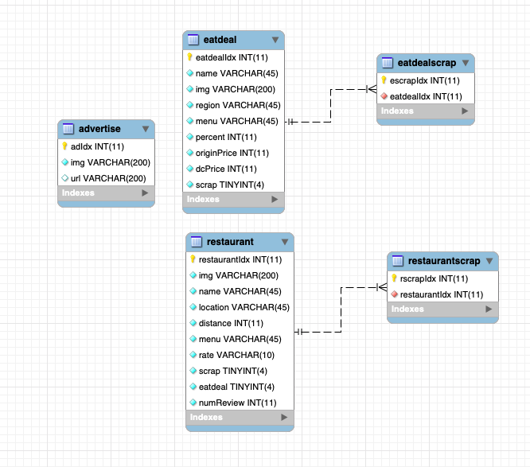
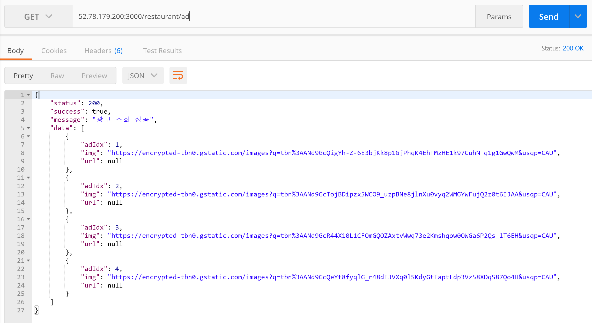
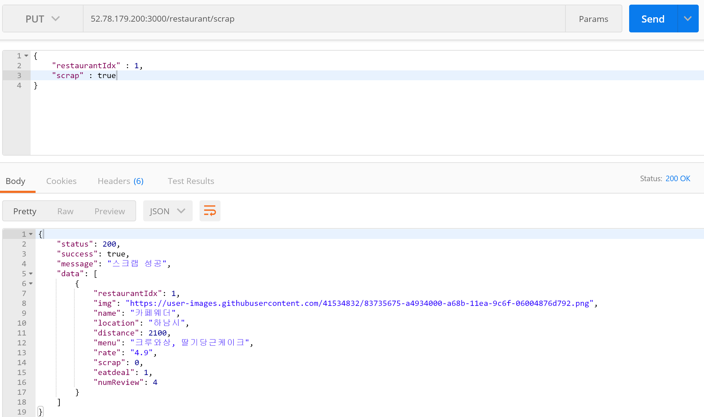
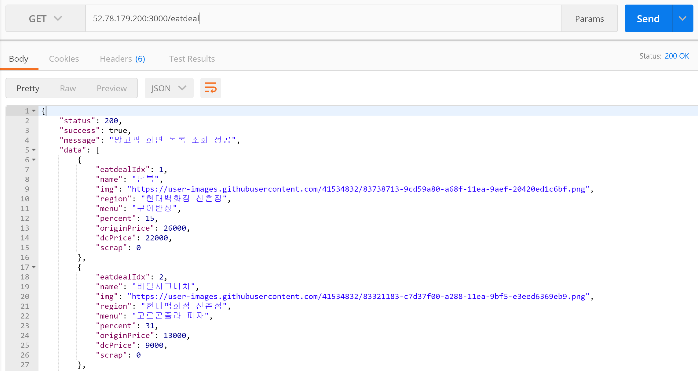
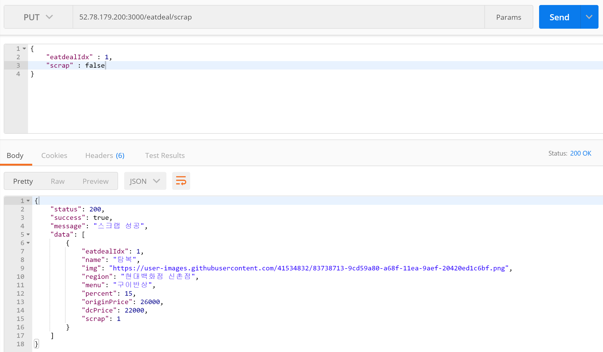
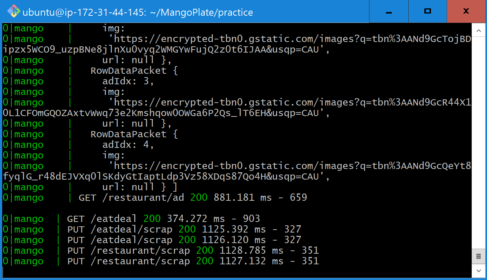

# Mango Plate

## client/server 합동 세미나 2조 ❗❗
김가인, 김해리

### API 명세서 확인하러 가기 👇

[Mango Plate API 명세서](https://github.com/rkdls8268/MangoPlate/wiki)

## ERD 💖

## API TEST

### 1. 맛집찾기 목록 조회

### 2. 맛집찾기 광고

### 3. 맛집찾기 스크랩

#### 3-1. scrap: false(스크랩 X) 반대 상태 출력~

#### 3-2. scrap: true(스크랩 O) 마찬가지로 반대 상태 출력~

### 4. 망고픽 목록 조회

### 5. 망고픽 스크랩

#### 5-1. scrap: false(스크랩 X) 반대 상태 출력~

#### 5-2. scrap: true(스크랩 O) 마찬가지로 반대 상태 출력~

### TERMINAL LOG

